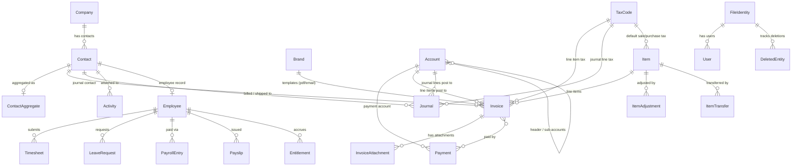

# Saasu Model Relationships

Persisted Saasu resources exposed by this gem and how they relate. Fields are omitted — names and relationships only.

Notes:

- Every resource is scoped to a Saasu file (`FileId`); only User and DeletedEntity are drawn against FileIdentity to avoid a hub-and-spoke diagram.
- `Employee`, `Timesheet`, `LeaveRequest`, `PayrollEntry`, `Payslip`, and `Entitlement` are the `Saasu::Payroll::*` classes.
- Search, LookupData, and Reports are excluded — they query or compute over the models above but store no data.
